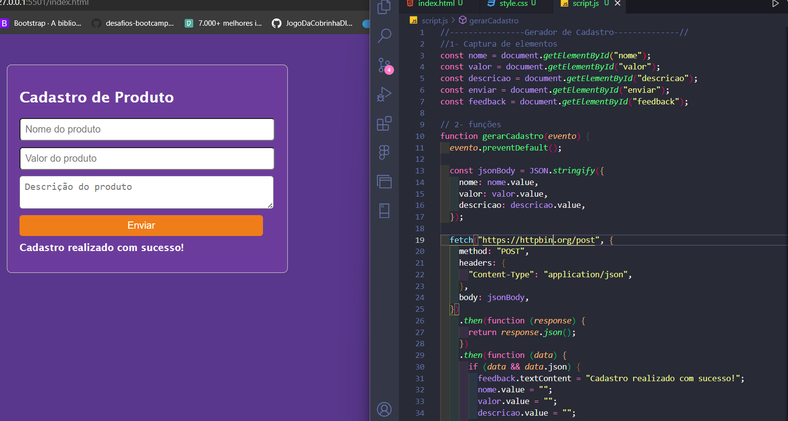

<h1 align="center"> API 💻 </h1>

 <a href="https://prozeducacao.com.br/unidade/unidade-curitiba/" target="_blank">PROZ</a> 

<a href="#sobre">Sobre</a>&nbsp;&nbsp;&nbsp|&nbsp;&nbsp;&nbsp;
<a href="#tecnologia">Tecnologia</a>&nbsp;&nbsp;&nbsp|&nbsp;&nbsp;&nbsp;
<a href="#autor">Autor</a>.

# Sobre

 
 Crie um site simples com inputs para o nome, o valor, a descrição do produto e um botão para enviar as informações, além de um elemento textual vazio para mostrar um feedback. Escreva o código JavaScript necessário para capturar as informações inseridas pelo usuário, enviá-las para o Back End usando a Fetch API, e tratar a resposta da requisição avisando ao usuário se o cadastro do produto foi ou não realizado com sucesso. Lembre de limpar os inputs caso a requisição seja tratada com sucesso, e de manter os valores preenchidos pelo usuário caso a requisição for rejeitada.
     

<section align="center" >
  <figure >

  </figure>
  
</section>

 

 
 <strong> 1. Captura de elementos: </strong>

Neste código, estamos capturando elementos do HTML. Esses elementos são como partes de uma página da web, como botões e textos, e podemos interagir com eles usando JavaScript.

<strong>2. Funções:</strong>

gerarCadastro(): Esta é uma função que é chamada quando queremos gerar um novo cadastro. O que ela faz é basicamente pedir à internet informações sobre um novo cadastro de produto usando uma técnica chamada "API". Ela pega essas informações e mostra na página.

<strong> 3. Eventos:</strong>

Aqui, estamos dizendo que quando o botão enviar (o botão que gera um novo usuário) é clicado, queremos chamar a função gerarCadastro() que explicamos acima.
Então, basicamente, quando alguém clica no botão, a função gerarCadastro() é ativada. Ela faz um novo cadastro da internet e mostra essas informações na página.

 

 

# Tecnologia

Esse projeto foi desenvolvindo com as seguintes tecnologias:

- HTML
- CSS
- JavaScript
- Markdown
- IDE VisualStudio Code
- Git e Github

# Autor

_Daniela Velter_
 
 

